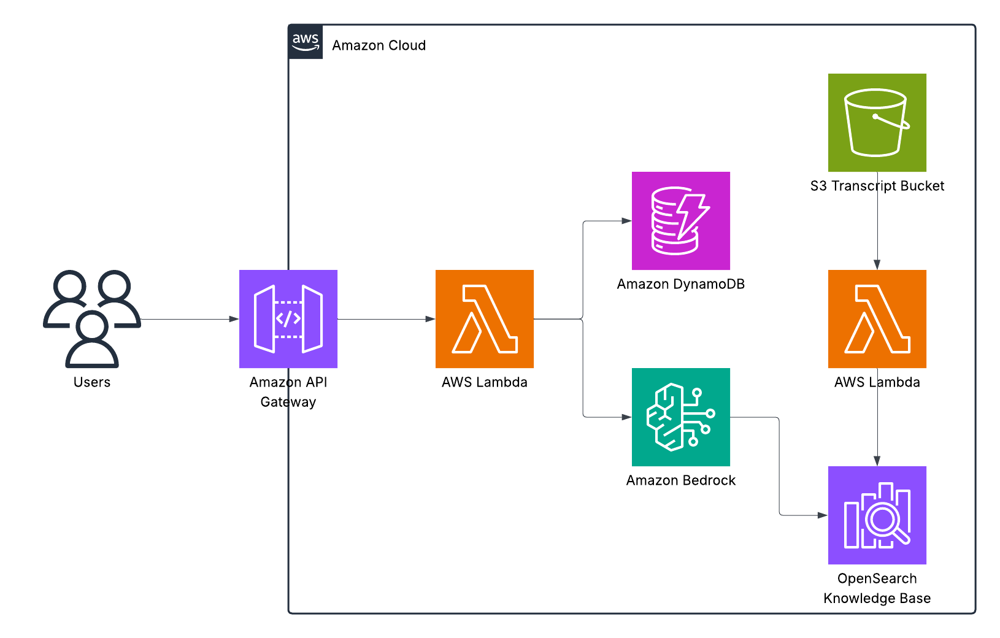
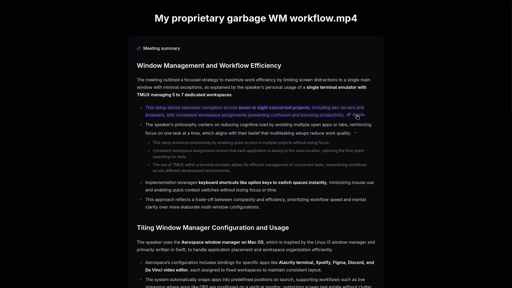

# Progress

| Task                        |     |
| --------------------------- | --- |
| System Architecture Diagram | ✅  |
| LLM Prompting Strategy      |     |
| Infrastructure as Code      |     |
| Front-End Prototype         | ✅  |

## System Architecture Diagram



## LLM Prompting Strategy

### Solution design:

A **Retrieval-Augmented Generation (RAG)** pipeline to let users request a deeper explanation for any summary bullet point. When a user clicks on a bullet, the system retrieves relevant transcript segments or meeting notes from the Knowledge Base (OpenSearch) using the bullet text as the query. These retrieved passages are then passed to the LLM with a carefully constructed prompt that asks for an elaborated, context-aware explanation ensuring that expansions remain grounded in the actual meeting content, not hallucination.

**Flow:**

1. User selects bullet point → bullet text is used as query
1. Retrieve top-k most relevant transcript chunks
1. Construct prompt combining bullet + retrieved text
1. LLM generates detailed explanation (optionally with citations to retrieved chunks)

### Prompt design:

```
You are an AI meeting assistant. A user wants a more detailed explanation of a summary bullet point from a meeting.

Meeting topic: {meeting_title}
Bullet point: "{bullet_text}"

Here are the relevant parts of the transcript:
{retrieved_context}

Explain this bullet point in more detail using the transcript above as context.
Avoid speculation, base your explanation only on the provided text.
```

**Explanation:**

```
                     Assign a persona                                         Describe the task
              |------------------------------| |--------------------------------------------------------------------------------|
              You are an AI meeting assistant. A user wants a more detailed explanation of a summary bullet point from a meeting.

      Input > Meeting topic: {meeting_title}
            > Bullet point: {bullet_text}

    Context > Here are the relevant parts of the transcript:
            > {retrieved_context}

Instruction > Explain this bullet point in more detail using the transcript above as context.
            > Avoid speculation, base your explanation only on the provided text.
```

Optional:

- **chain-of-thought guidance** (e.g., “reason step-by-step before summarizing”) for better quality but consumes more tokens.

### **Model selection:**

**Claude 3.0 Sonnet**

Criteria:

- **Base model:** Use a **general-purpose foundation model** optimized for summarization and reasoning on AWS (Claude, Mistral, or Titan Text G1 family).
- **Context window size**: 200K tokens gives of room to include more retrieved transcript chunks + the prompt without hitting limits.
- **Cost trade-off**: While Claude 3 Sonnet is more expensive than lighter models the extra cost is justified by improved output quality and reduced errors.

## Infrastructure as Code (Terraform)


## Front-End Prototype (React)


